I learned to program by building things I use every day. I work across
web and mobile with React & React Native, and keep sharpening systems
skills in Go. Clean architecture, tests that mean something, and tools
that respect the keyboard.

**Portfolio** → [kevindev.co](https://kevindev.co/)

## Connect

**❯** [linkedin.com/in/kevindm14](https://www.linkedin.com/in/kevindm14/) 
**❯** [kevindev.co](https://kevindev.co/) 
**❯** [kevindiazm.14@gmail.com](mailto:kevindiazm.14@gmail.com)

made with a keyboard in Colombia 🇨🇴
