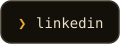
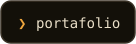
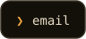

Aprendí a programar construyendo cosas que uso todos los días. Trabajo en
web y móvil con React y React Native, y sigo afilando mis habilidades de
sistemas con Go. Arquitectura limpia, tests que significan algo y
herramientas que respetan el teclado.

**Portafolio** → [kevindev.co](https://kevindev.co/)

## Contacto

  &nbsp;
  &nbsp;
  

hecho con un teclado en Colombia 🇨🇴
